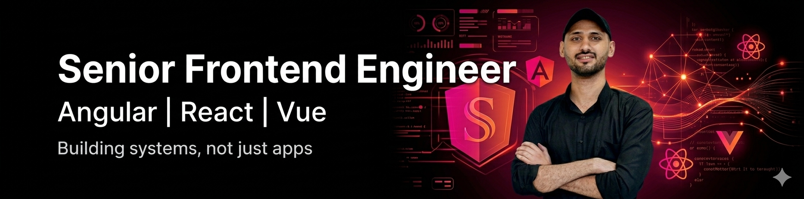
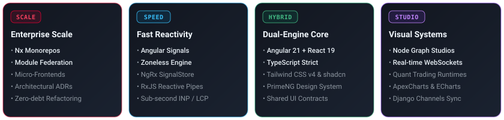

<div align="center">

  <!-- 🌟 Top Hero Banner -->
  <a href="https://elsherbiniy.com">
    
  </a>

  <!-- ⚡ Dynamic Typewriter Headline -->
  <p align="center">
    <a href="https://elsherbiniy.com">
      
    </a>
  </p>

  <!-- 🛡️ Badges & Identity -->
  <p align="center">
    <a href="https://maps.google.com/?q=Cairo,Egypt">
      
    </a>
    <a href="https://github.com/mostafa201272">
      
    </a>
    <a href="https://elsherbiniy.com">
      
    </a>
    <a href="https://x.com/M_M_Elsherbiniy">
      
    </a>
    <a href="mailto:mostafa.elsherbini@ctx.ae">
      
    </a>
    <a href="https://komarev.com/ghpvc/?username=mostafa201272">
      
    </a>
  </p>

</div>

<p align="center">
  
</p>

## 💻 Developer DNA & Architectural Mindset

```text
"Building systems, not just apps."
```

I am a **Senior Frontend Engineer & Software Architect** specializing in large-scale enterprise web applications, real-time data engines, and modular micro-frontend ecosystems. My work bridges the gap between deep client-side performance (fine-grained reactivity, sub-second INP, zoneless Angular, React 19) and hardened system architecture (strict TypeScript contracts, Nx monorepos, and Python/Django backends).

<p align="center">
  
</p>

<p align="center">
  
</p>

## 🏛️ Architectural Pillars

<p align="center">
  
</p>

<p align="center">
  
</p>

## ⚡ Warfare Arsenal & Tech Stack

<table>
  <tr>
    <td width="25%" valign="top"><b>Core Frameworks</b></td>
    <td width="75%">
      
      
      
      
      
    </td>
  </tr>
  <tr>
    <td width="25%" valign="top"><b>Reactivity &amp; State</b></td>
    <td width="75%">
      
      
      
      
      
    </td>
  </tr>
  <tr>
    <td width="25%" valign="top"><b>UI Architecture &amp; Styles</b></td>
    <td width="75%">
      
      
      
      
      
    </td>
  </tr>
  <tr>
    <td width="25%" valign="top"><b>Visual Studios &amp; Real-Time</b></td>
    <td width="75%">
      
      
      
      
      
    </td>
  </tr>
  <tr>
    <td width="25%" valign="top"><b>Backend, Data &amp; Cloud</b></td>
    <td width="75%">
      
      
      
      
      
      
    </td>
  </tr>
  <tr>
    <td width="25%" valign="top"><b>Tooling &amp; Infrastructure</b></td>
    <td width="75%">
      
      
      
      
      
      
    </td>
  </tr>
</table>

<p align="center">
  
</p>

## 🚀 Featured Architectural Systems

<table width="100%">
  <tr>
    <td width="50%" valign="top">
      <h3>📈 <a href="https://github.com/mostafa201272/trading-eye">Trading-Eye</a></h3>
      <p><b>Visual Workflow Studio for Crypto &amp; Financial Runtimes</b></p>
      <p>A visual node-graph studio enabling traders to architect, backtest, and run multi-runtime algorithmic strategies across <code>BACKTEST → PAPER → TESTNET → LIVE</code>.</p>
      <ul>
        <li><b>Frontend:</b> Angular 21 Zoneless, NgRx SignalStore, PrimeNG, Tailwind CSS, Rete.js visual canvas.</li>
        <li><b>Backend:</b> Python Django, DRF, Django Channels (WebSockets), CCXT, TimescaleDB, Redis.</li>
        <li><b>Architecture:</b> Shared JSON schema contracts, decoupled node executors, and micro-frontend design.</li>
      </ul>
    </td>
    <td width="50%" valign="top">
      <h3>📊 <a href="https://github.com/mostafa201272/atlas-logix">Atlas Logix Suite</a></h3>
      <p><b>Enterprise Dual-Engine Analytics &amp; Operations Dashboards</b></p>
      <p>High-density telemetry dashboards engineered in both Angular and React to demonstrate architectural parity and modular state orchestration.</p>
      <ul>
        <li><b><a href="https://github.com/mostafa201272/atlas-logix">Atlas-Logix (Angular)</a>:</b> Angular 21, NgRx Signals, PrimeNG 21, ApexCharts, Tailwind CSS v4.</li>
        <li><b><a href="https://github.com/mostafa201272/atlas-logix-react">Atlas-Logix (React)</a>:</b> React 19, Vite, Zustand, Radix UI, Lucide, Tailwind CSS v4.</li>
      </ul>
    </td>
  </tr>
  <tr>
    <td width="50%" valign="top">
      <h3>🛡️ <a href="https://github.com/mostafa201272/pkce-task-react-django">PKCE Security Engine</a></h3>
      <p><b>Zero-Trust OAuth2 Flow for Modern SPAs</b></p>
      <p>End-to-end implementation of the Proof Key for Code Exchange (RFC 7636) security mechanism, preventing authorization code interception on public client applications.</p>
      <ul>
        <li><b>Stack:</b> React, Django REST Framework, Crypto Subtle API, Secure Session Storage.</li>
        <li><b>Focus:</b> Token hygiene, silent refresh flows, state verification.</li>
      </ul>
    </td>
    <td width="50%" valign="top">
      <h3>🏛️ <a href="https://github.com/mostafa201272/nx-angular">Enterprise Nx Monorepo</a></h3>
      <p><b>Scalable Architecture Blueprint for Multi-Team Apps</b></p>
      <p>Production-grade monorepo setup demonstrating dependency boundary enforcement, module federation, and reusable component libraries.</p>
      <ul>
        <li><b>Stack:</b> Nx Workspace, Angular 21, TypeScript Project References, ESLint Boundary Rules.</li>
        <li><b>Focus:</b> CI caching, modular build graph, shared UI tokens.</li>
      </ul>
    </td>
  </tr>
</table>

<p align="center">
  
</p>

## 📊 Live Metrics & GitHub Analytics

<div align="center">
  <table border="0">
    <tr>
      <td align="center" valign="middle">
        <a href="https://github.com/mostafa201272">
          
        </a>
      </td>
      <td align="center" valign="middle">
        <a href="https://github.com/mostafa201272">
          
        </a>
      </td>
    </tr>
    <tr>
      <td align="center" colspan="2">
        <a href="https://github.com/mostafa201272">
          
        </a>
      </td>
    </tr>
  </table>
</div>

<p align="center">
  
</p>

## 🐍 Contribution Stream

<p align="center">
  <picture>
    <source media="(prefers-color-scheme: dark)" srcset="https://raw.githubusercontent.com/mostafa201272/mostafa201272/output/github-contribution-grid-snake-dark.svg" />
    <source media="(prefers-color-scheme: light)" srcset="https://raw.githubusercontent.com/mostafa201272/mostafa201272/output/github-contribution-grid-snake.svg" />
    
  </picture>
</p>

<p align="center">
  
</p>

## 📜 The Software Architect's Manifesto

> *"Simple things should be simple, complex things should be possible — but enterprise things must be maintainable."*

1. **Architecture Before Code**: Write ADRs (Architectural Decision Records) before introducing framework churn.
2. **Reactivity Over Dirty Checking**: Leverage Angular Signals and push-based observable pipelines to achieve zero unnecessary re-renders.
3. **Contracts Across Boundaries**: Never trust loose payloads. Validate data at the edges with strict TypeScript and runtime schemas.
4. **Resilient User Experience**: Sub-second Largest Contentful Paint (LCP) and zero Input Delay (INP) are non-negotiable standards.

<p align="center">
  
</p>

## 🤝 Let's Connect & Collaborate

<div align="center">

  <p>
    Whether you are building a mission-critical enterprise web platform, designing a high-frequency trading UI, or modernizing frontend architecture, let's talk.
  </p>

  <p align="center">
    <a href="https://elsherbiniy.com">
      
    </a>
    <a href="https://x.com/M_M_Elsherbiniy">
      
    </a>
    <a href="https://www.linkedin.com/in/mostafa-elsherbiniy/">
      
    </a>
    <a href="mailto:mostafa.elsherbini@ctx.ae">
      
    </a>
    <a href="mailto:mostafa201272@yahoo.com">
      
    </a>
  </p>

  <br />

  <sub>Crafted with precision &amp; architectural passion by <b>Eng/ Mostafa Mahmoud El-sherbiniy</b></sub>

</div>
